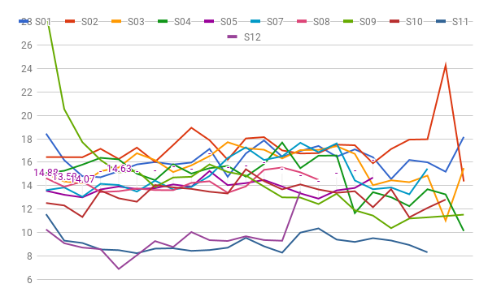
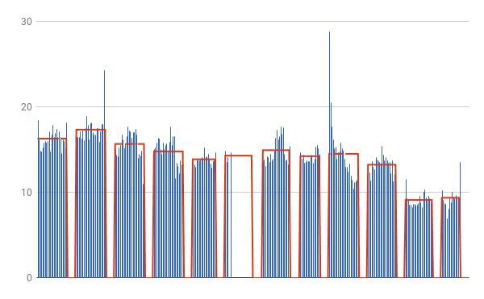
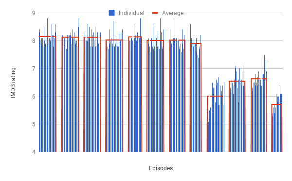

# Rose

Analyse all kinds of data for a TV series.


Rose (of Two and a Half Men) is a highly intelligent, deceiving and manipulative woman. In the beginning of the series she was nothing more than one of Charlie's one night stand however she quickly turned into his stalker, she has an obsessive nature and both loves and resents Charlie.

Rose (this repository) aims to be something similar. For a given TV series, it scrapes the following:

* U.S viewers (in millions)
* IMDB ratings.

## Why

Two and a Half Men is one of the few shows available on Indian English channels, of which I had watched a few episodes during JEE days. I had the recent urge to finish the series. One observation everyone would make is as the season progressed, the last seasons really took a hit. Series finale was the worst, hitting the lowest the series had ever seen (IMDB 4.3).

I wanted to observe if there was any pattern here. Due to lack of proper existing tools and [GraphTV](http://graphtv.kevinformatics.com) going down, I had to take matter into my own hands.


## Results

The results are being rendered via Google sheets charts, because they're interactive. Clicking on a certain image would help, because I couldn't embed google charts in iframes.

The first chart plots views for each episode across seasons. The second chart plots views per episode and average season views.

### TV views

[](https://docs.google.com/spreadsheets/d/e/2PACX-1vSYgcXvLA7HYxnFTLUMdW3dkvPFl9HE2ulO0qObS2Y6xsIZq1tlIabu-p1LG-2X_lBYHIZOvSrOmtpR/pubchart?oid=743901098&amp;format=interactive) [](https://docs.google.com/spreadsheets/d/e/2PACX-1vSYgcXvLA7HYxnFTLUMdW3dkvPFl9HE2ulO0qObS2Y6xsIZq1tlIabu-p1LG-2X_lBYHIZOvSrOmtpR/pubchart?oid=1321595076&amp;format=interactive)


### IMDB

[](https://docs.google.com/spreadsheets/d/e/2PACX-1vSYgcXvLA7HYxnFTLUMdW3dkvPFl9HE2ulO0qObS2Y6xsIZq1tlIabu-p1LG-2X_lBYHIZOvSrOmtpR/pubchart?oid=1262982098&amp;format=interactive) [](https://docs.google.com/spreadsheets/d/e/2PACX-1vSYgcXvLA7HYxnFTLUMdW3dkvPFl9HE2ulO0qObS2Y6xsIZq1tlIabu-p1LG-2X_lBYHIZOvSrOmtpR/pubchart?oid=72754234&amp;format=interactive)

The [dataset](https://docs.google.com/spreadsheets/d/11fuBypPfB_egoWfZCQr2TbtXgiYKT1k8ZGmih_Cgwsg) is available here for viewing.

## Observations

Charlie Sheen was one of the male lead for first 8 seasons, who was replaced by Ashton Kutcher. The script writing went horrible, and some correlation in the data was expected.

The data confers. Observing the number of views, S11 and S12 took a big hit. S09E01 saw a change in the lead thus the spike in views. It was expected to see a spike in views every season finale, but that was not necessarily true here. Seeing IMDB, which mostly confers to scriptwriting, Season 9 onwards became really bad, so Ashton wasn't really to blame.

## Usage

```
> python3 scrape_views.py -h

optional arguments:
  -h, --help            show this help message and exit
  -i, --imdb            Display only imdb ratings
  -w, --wiki            Display only wikipedia US TV viewers
  -s SHOW, --show SHOW  Provide show name
  -b BAR, --bar BAR     Display bar chart or not
  -a AVG, --avg AVG     Display averaged chart or not
  -e EPISODE, --epi EPISODE Provide Specific Episode Details

> python3 scrape_views.py -i -a -s 'Two and a half men'
> python3 scrape_views.py -s 'Two and a half men' -e 'S03E06'

```

You can view multiple imdb plots in [GALLERY.md](GALLERY.md).

## ToDos

- [x] Scrape number of seasons from wikipedia page.
- [x] Make show urls dynamic. (Search wikipedia page and imdb page only by knowing show name)
- [ ] Print details of episode / movie playing in default video player, akin to x-ray from Amazon Prime.
- [ ] Tests! (Works with other series, but need to detect cornercases)

## Licencse

The MIT License (MIT) 2018 - [Kaustubh Hiware](http://kaustubhhiware.github.io). Have a look at the [LICENSE](LICENSE) for more details.
